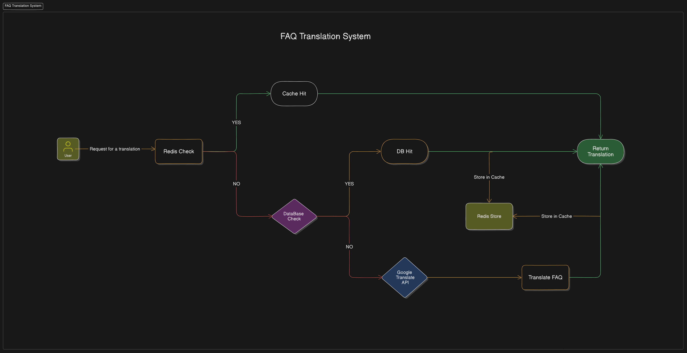

# FAQ_BharatFD

FAQ_BharatFD is a full-stack web application for managing Frequently Asked Questions (FAQs). It includes a frontend built with React and a backend built with Node.js, Express, and MongoDB. The application supports multiple languages and includes admin authentication for managing FAQs.

## Table of Contents

- [Installation](#installation)
- [Architecture](#Architecture)
- [Usage](#usage)
- [API Documentation](#api-documentation)
- [Contribution Guidelines](#contribution-guidelines)


## Installation

### Prerequisites

- Docker
- Docker Compose

### Steps

1. **Clone the repository:**

   ```sh
   git clone https://github.com/yourusername/FAQ_BharatFD.git
   cd FAQ_BharatFD
   ```

2. **Create a `.env` file in the root directory:**

   Use the provided `.env.example` file as a template:

   ```sh
   cp .env.example .env
   ```

   Fill in the required environment variables in the `.env` file.

3. **Build and start the Docker containers:**

   ```sh
   docker-compose up --build
   ```

   This will build and start the frontend, backend, Redis, and MongoDB services.

4. **Access the application:**

   - Frontend: [http://localhost:3000](http://localhost:3000)
   - Backend: [http://localhost:5000](http://localhost:5000)

## Usage

### Running the Application

To run the application, use the following command:

```sh
docker-compose up
```

This will start all the services defined in the `docker-compose.yml` file.

### Stopping the Application

To stop the application, use the following command:

```sh
docker-compose down
```

## Architecture

The following diagram illustrates the flow of the translation system 



### Workflow Description

1. When a user requests an FAQ in a specific language, the system follows this flow:
   - **Redis Cache Check:** If the translation exists, it's returned directly.
   - **Database Check:** If not in Redis, MongoDB is queried. If found, it is returned and cached in Redis.
   - **Google Translation API:** If not in MongoDB, Google Translation API is called to generate the translation, which is then cached in Redis and optionally saved in MongoDB.

2. All FAQs and translations are stored in MongoDB, while Redis is used for quick access with time-based caching.


## API Documentation

### Authentication

#### Admin Login

- **URL:** `/api/admin/login`
- **Method:** `POST`
- **Request Body:**
  ```json
  {
    "email": "admin@example.com",
    "password": "adminpassword"
  }
  ```
- **Response:**
  ```json
  {
    "message": "Login successful"
  }
  ```

#### Admin Logout

- **URL:** `/api/admin/logout`
- **Method:** `POST`
- **Response:**
  ```json
  {
    "success": true,
    "message": "Logout successful"
  }
  ```

#### Check Authentication

- **URL:** `/api/admin/check-auth`
- **Method:** `GET`
- **Response:**
  ```json
  {
    "message": "Authenticated"
  }
  ```

### FAQs

#### Get All FAQs

- **URL:** `/api/faqs`
- **Method:** `GET`
- **Response:**
  ```json
  [
    {
      "_id": "faq_id",
      "question": "What is FAQ?",
      "answer": "Frequently Asked Questions",
      "translations": [
        {
          "lang": "hi",
          "question": "FAQ क्या है?",
          "answer": "अक्सर पूछे जाने वाले प्रश्न"
        }
      ]
    }
  ]
  ```

#### Get FAQ by ID

- **URL:** `/api/faqs/:id`
- **Method:** `GET`
- **Response:**
  ```json
  {
    "_id": "faq_id",
    "question": "What is FAQ?",
    "answer": "Frequently Asked Questions",
    "translations": [
      {
        "lang": "hi",
        "question": "FAQ क्या है?",
        "answer": "अक्सर पूछे जाने वाले प्रश्न"
      }
    ]
  }
  ```

#### Create FAQ

- **URL:** `/api/faqs`
- **Method:** `POST`
- **Request Body:**
  ```json
  {
    "question": "What is FAQ?",
    "answer": "Frequently Asked Questions"
  }
  ```
- **Response:**
  ```json
  {
    "message": "FAQ created successfully",
    "faq": {
      "_id": "faq_id",
      "question": "What is FAQ?",
      "answer": "Frequently Asked Questions",
      "translations": []
    }
  }
  ```

#### Update FAQ

- **URL:** `/api/faqs/:id`
- **Method:** `PUT`
- **Request Body:**
  ```json
  {
    "question": "Updated question",
    "answer": "Updated answer"
  }
  ```
- **Response:**
  ```json
  {
    "message": "FAQ updated successfully",
    "faq": {
      "_id": "faq_id",
      "question": "Updated question",
      "answer": "Updated answer",
      "translations": []
    }
  }
  ```

#### Delete FAQ

- **URL:** `/api/faqs/:id`
- **Method:** `DELETE`
- **Response:**
  ```json
  {
    "message": "FAQ deleted successfully"
  }
  ```

## Contribution Guidelines

To contribute, please follow these steps:

1. **Fork the repository:**

   Click the "Fork" button at the top right corner of the repository page.

2. **Clone your forked repository:**

   ```sh
   git clone https://github.com/yourusername/FAQ_BharatFD.git
   cd FAQ_BharatFD
   ```

3. **Create a new branch:**

   ```sh
   git checkout -b feature/your-feature-name
   ```

4. **Make your changes:**

   Implement your changes and commit them with a descriptive message.

5. **Push your changes to your forked repository:**

   ```sh
   git push origin feature/your-feature-name
   ```

6. **Create a pull request:**

   Go to the original repository and click the "New pull request" button. Provide a detailed description of your changes and submit the pull request.
